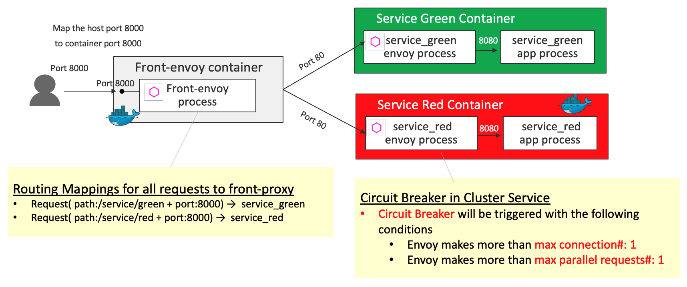

# Circuit Breaker

[Circuit Breaking](https://www.envoyproxy.io/learn/circuit-breaking) lets you configure failure thresholds that ensure safe maximums after which these requests stop. This allows for a more graceful failure, and time to respond to potential issues before they become larger.

## Demo Overview



- Circuit Breaker is configured in `service_red` such that Circuit Breaker will be triggered with the following conditions:
  - Envoy makes more than `max connection#:1`
  - Envoy makes more than `max parallel requests#:1`

Key definition  - `clusters` in [service-envoy-circuitbreaker.yaml](service-envoy-circuitbreaker.yaml)
```yaml
  clusters:
  - name: local_service
    connect_timeout: 0.25s
    type: strict_dns
    lb_policy: round_robin
    circuit_breakers:
      thresholds:
        max_connections: 1
        max_pending_requests: 1
        max_requests: 1
    hosts:
    - socket_address:
        address: 127.0.0.1
        port_value: 8080
```
> For the detail of `circuit_breakers` configuration, see [cluster.CircuitBreakers](https://www.envoyproxy.io/docs/envoy/latest/api-v2/api/v2/cluster/circuit_breaker.proto#envoy-api-msg-cluster-circuitbreakers)

## Getting Started
```sh
git clone https://github.com/yokawasa/envoy-proxy-demos.git
cd envoy-proxy-demos/circuit-breaker
```
> [NOTICE] Before you run this demo, make sure that all demo containers in previous demo are stopped!

## Run the Demo
```sh
# Build and Run containers using docker-compose
$ docker-compose up --build -d

# check all services are up
$ docker-compose ps --service

front-envoy
service_green
service_red

# List containers
$ docker-compose ps
             Name                            Command               State                            Ports
----------------------------------------------------------------------------------------------------------------------------------
circuit-breaker_front-envoy_1     /usr/bin/dumb-init -- /bin ...   Up      10000/tcp, 0.0.0.0:8000->80/tcp, 0.0.0.0:8001->8001/tcp
circuit-breaker_service_green_1   /bin/sh -c /usr/local/bin/ ...   Up      10000/tcp, 80/tcp
circuit-breaker_service_red_1     /bin/sh -c /usr/local/bin/ ...   Up      10000/tcp, 80/tcp
```

Access and test each services
```sh
# Access serivce_blue and check if green background page is displayed.
# It is expected that nothting special will occur
$ curl -s http://localhost:8000/service/green

# Try paralell access to service_green
# It is expected that nothting special will occur
# The following helper command allow you to send parallel requests repeatedly (For example, send 5 parallel requests to http://localhost:8000/service/green, each thread make 30 consequent requests)
$ ../helpers/parallel-requests.sh http://localhost:8000/service/green 5


# Make at least 5 parallel requests to service_red in order to trigger circit breaker and see a few of requests receive 503 HTTP status code.
$ ../helpers/parallel-requests.sh http://localhost:8000/service/red 5

# or more exlude 200 status code to identify 503 status code easily like this:
$ ../helpers/parallel-requests.sh http://localhost:8000/service/red 5 | grep -v 200

Parallel# 1
Sending GET request: http://localhost:8000/service/red
Parallel# 2
Sending GET request: http://localhost:8000/service/red
Sending GET request: http://localhost:8000/service/red
Parallel# 3
Sending GET request: http://localhost:8000/service/red
Sending GET request: http://localhost:8000/service/red
Sending GET request: http://localhost:8000/service/red
Parallel# 4
Sending GET request: http://localhost:8000/service/red
Sending GET request: http://localhost:8000/service/red
Sending GET request: http://localhost:8000/service/red
Sending GET request: http://localhost:8000/service/red
Parallel# 5
Sending GET request: http://localhost:8000/service/red
Sending GET request: http://localhost:8000/service/red
Sending GET request: http://localhost:8000/service/red
Sending GET request: http://localhost:8000/service/red
503
Sending GET request: http://localhost:8000/service/red
Sending GET request: http://localhost:8000/service/red
Sending GET request: http://localhost:8000/service/red
Sending GET request: http://localhost:8000/service/red
Sending GET request: http://localhost:8000/service/red
503
Sending GET request: http://localhost:8000/service/red
Sending GET request: http://localhost:8000/service/red
Sending GET request: http://localhost:8000/service/red
Sending GET request: http://localhost:8000/service/red
```

## Stop & Cleanup
```sh
$ docker-compose down --remove-orphans --rmi all
```
