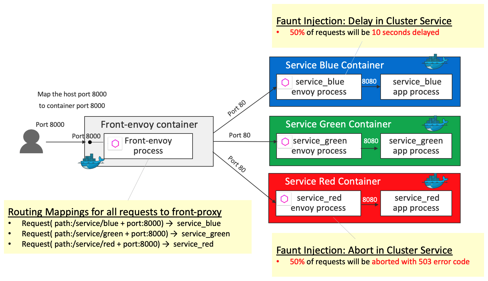

# Fault Injection

[Fault injection](https://www.envoyproxy.io/docs/envoy/latest/configuration/http/http_filters/fault_filter) is a technique for improving the coverage of a test by introducing faults to test code paths, in particular error handling code paths, that might otherwise rarely be followed. The `filter` ( [http_filters](https://www.envoyproxy.io/docs/envoy/latest/configuration/http/http_filters/http_filters) in the demo ) can be used to inject `delays` and `abort` requests with user-specified error codes.

## Demo Overview



Front-proxy configurations are the same as the ones in [HTTP Routing: Simple Match Routing](../httproute-simple-match). Differences from [HTTP Routing: Simple Match Routing](../httproute-simple-match) are the following 2 fault injections:
- Fault injection `abort` (50% of requests will be aborted with 503 error code) for the requests to `service_red`
- Fault injection `delay` (50% of requests will be 10 seconds delayed) for the requests to `service_blue`

Key definition 1 - `http_filters` in [service-envoy-fault-injection-abort.yaml](service-envoy-fault-injection-abort.yaml)
```yaml
  http_filters:
  - name: envoy.filters.http.fault
    typed_config:
      "@type": type.googleapis.com/envoy.config.filter.http.fault.v2.HTTPFault
      abort:
        http_status: 503
        percentage:
          numerator: 50
          denominator: HUNDRED
```
> For `numerator` and `denominator` of `percentage`, see [type.FractionalPercent](https://www.envoyproxy.io/docs/envoy/latest/api-v2/type/percent.proto#envoy-api-msg-type-fractionalpercent)

Key definition 2 - `http_filters` in [service-envoy-fault-injection-delay.yaml](service-envoy-fault-injection-delay.yaml)
```yaml
  http_filters:
  - name: envoy.filters.http.fault
    typed_config:
      "@type": type.googleapis.com/envoy.config.filter.http.fault.v2.HTTPFault
      delay:
        fixed_delay: 10s
        percentage:
          numerator: 50
          denominator: HUNDRED
```
> For `fixed_delay` and `percentage` of delay injection, see [config.filter.fault.v2.FaultDelay](https://www.envoyproxy.io/docs/envoy/latest/api-v2/config/filter/fault/v2/fault.proto#envoy-api-msg-config-filter-fault-v2-faultdelay)

## Getting Started
```sh
$ git clone https://github.com/yokawasa/envoy-proxy-demos.git
$ cd envoy-proxy-demos/fault-injection
```

> [NOTICE] Before you run this demo, make sure that all demo containers in previous demo are stopped!

## Run the Demo

### Build and Run containers using docker-compose

```sh
$ docker-compose up --build -d

# check all services are up
$ docker-compose ps --service

front-envoy
service_blue
service_green
service_red

# List containers
$ docker-compose ps

             Name                            Command               State                            Ports
----------------------------------------------------------------------------------------------------------------------------------
fault-injection_front-envoy_1     /docker-entrypoint.sh /bin ...   Up      10000/tcp, 0.0.0.0:8000->8000/tcp, 0.0.0.0:8001->8001/tcp
fault-injection_service_blue_1    /bin/sh -c /usr/local/bin/ ...   Up      10000/tcp, 80/tcp                                        
fault-injection_service_green_1   /bin/sh -c /usr/local/bin/ ...   Up      10000/tcp, 80/tcp                                        
fault-injection_service_red_1     /bin/sh -c /usr/local/bin/ ...   Up      10000/tcp, 80/tcp 
```

### Access and test each services
Access serivce_blue and check if 50% of requests to service_blue are 10 seconds delayed. The following helper command allow you to send requests repeatedly (For example, send 10 requests to http://localhost:8000/service/blue).

```sh
$ ../helpers/send-requests.sh http://localhost:8000/service/blue 10

Sending GET request: http://localhost:8000/service/blue
200
Sending GET request: http://localhost:8000/service/blue
200
..
```

Access serivce_red and check if 50% of requests to service_red are aborted with 503 HTTP status code. The following helper command allow you to send requests repeatedly (For example, send 10 requests to http://localhost:8000/service/red).

```sh
$ ../helpers/send-requests.sh http://localhost:8000/service/red 10

Sending GET request: http://localhost:8000/service/red
503
Sending GET request: http://localhost:8000/service/red
200
Sending GET request: http://localhost:8000/service/red
503
```

## Stop & Cleanup

```sh
$ docker-compose down --remove-orphans --rmi all
```

---
[Top](../README.md)
